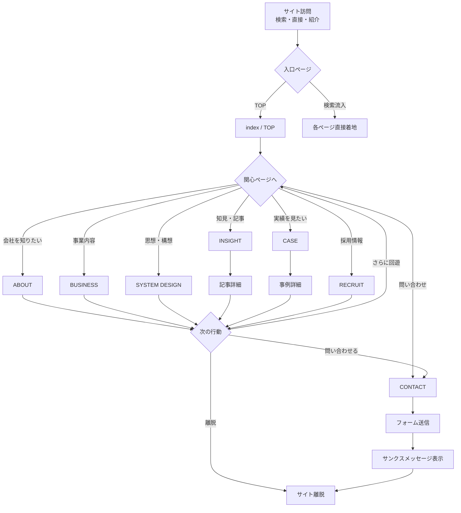
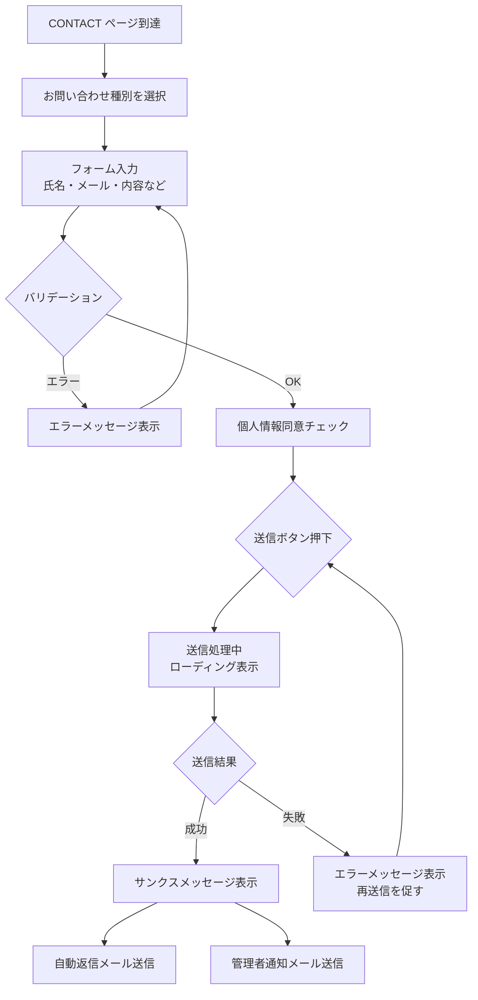
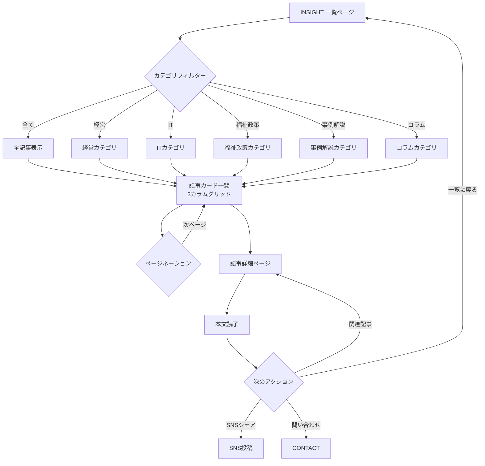
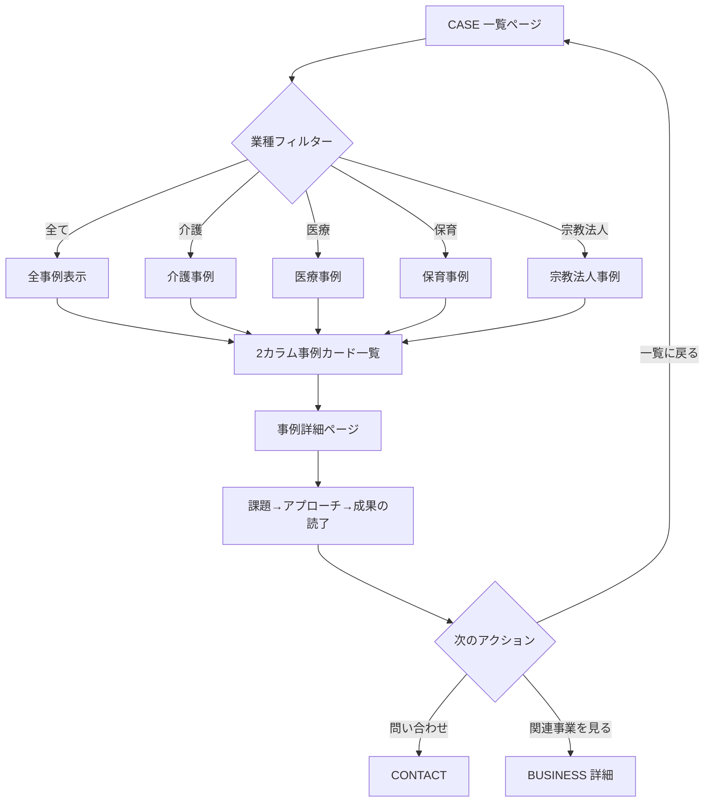

# フェンリルイノベーションズ — ユーザーフロー図

## 1. サイト全体ナビゲーションフロー



---

## 2. 問い合わせフロー



---

## 3. INSIGHT ブログ閲覧フロー



---

## 4. CASE 事例閲覧フロー



---

## 5. BUSINESS 詳細閲覧フロー

```mermaid
flowchart TD
    A[BUSINESS 一覧ページ\n4事業軸カード] --> B{事業選択}
    B -->|01| C[/business/consulting/\n総合コンサルティング]
    B -->|02| D[/business/it-support/\nIT導入支援]
    B -->|03| E[/business/chain-store/\nチェーンストア基盤]
    B -->|04| F[/business/ma-new-business/\nM&A・新規事業]

    C --> G[概要→サービス内容→支援の流れ→対象クライアント]
    D --> G
    E --> G
    F --> G

    G --> H{アクション}
    H -->|問い合わせ| I[CONTACT]
    H -->|他事業を見る| A
    H -->|関連INSIGHT| J[INSIGHT 記事詳細]
```
