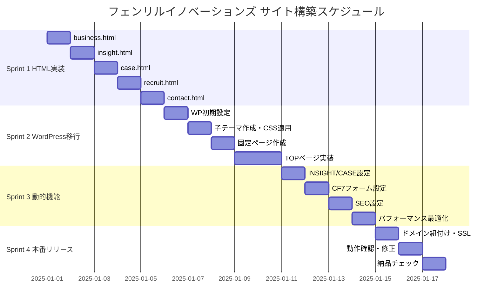

# スプリント計画 — フェンリルイノベーションズ コーポレートサイト

## 全体サマリー

| 項目 | 内容 |
|------|------|
| 総スプリント数 | 4スプリント |
| 予定総期間 | 約3〜4週間 |
| 現在地 | Sprint 1 進行中（index/about/system-design 完了） |

---

## スプリント一覧

| Sprint | テーマ | 期間 | 状態 |
|--------|--------|------|------|
| [Sprint 1](sprint-1.md) | 残5ページHTML実装 | 3〜4日 | 🟡 進行中 |
| [Sprint 2](sprint-2.md) | WordPress移行・基盤構築 | 5日 | ⏳ 待機中 |
| [Sprint 3](sprint-3.md) | 動的コンテンツ・フォーム・SEO | 3〜4日 | ⏳ 待機中 |
| [Sprint 4](sprint-4.md) | ドメイン・SSL・本番確認・納品 | 2〜3日 | ⏳ 待機中 |

---

## 依存関係図

---

## フェーズ全体 Exit Criteria

| フェーズ | 条件 |
|---------|------|
| Sprint 1完了 | 全8ページのHTMLが静的デモとして動作確認済み |
| Sprint 2完了 | WordPressで全固定ページが表示され、ナビゲーションが機能する |
| Sprint 3完了 | CF7フォーム送信・自動返信確認済み。PageSpeed 80以上 |
| Sprint 4完了 | HTTPS化・本番ドメインでの全ページ表示確認・納品チェックリスト全✅ |

---

## 現在の実装状況

### 完了ページ
- [x] `index.html` — TOP ページ（11セクション構成）
- [x] `about.html` — ABOUT ページ
- [x] `system-design.html` — SYSTEM DESIGN ページ

### 未実装ページ（Sprint 1 スコープ）
- [ ] `business.html` — BUSINESS + 詳細4ページ
- [ ] `insight.html` — INSIGHT 一覧
- [ ] `case.html` — CASE 一覧
- [ ] `recruit.html` — RECRUIT
- [ ] `contact.html` — CONTACT

### 共通ファイル
- [x] `style.css` — グローバルCSS（CSS変数・コンポーネント）
- [x] `script.js` — スクロールアニメーション・ハンバーガーメニュー
