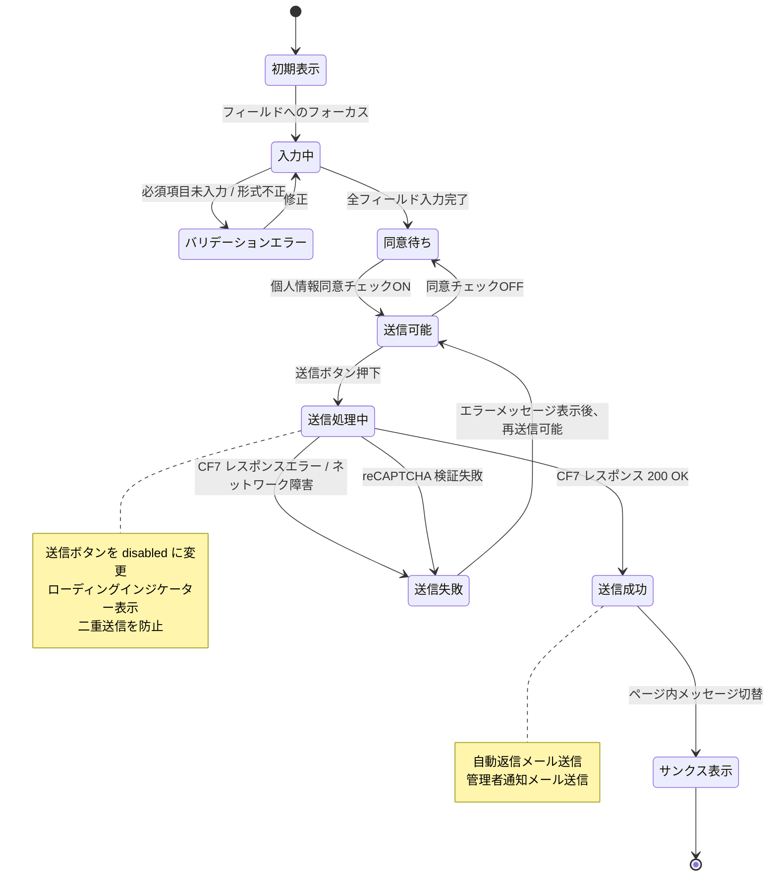

# 状態遷移図 — お問い合わせフォーム

## フォームの状態遷移

---

## 各状態の定義

| 状態 | 説明 | UI |
|------|------|-----|
| 初期表示 | ページロード直後。全フィールド空 | 通常表示 |
| 入力中 | 1つ以上のフィールドが入力された状態 | 通常表示 |
| バリデーションエラー | 必須未入力またはメール形式不正 | エラーメッセージ赤文字表示 |
| 同意待ち | 全入力完了だが個人情報同意未チェック | 送信ボタン disabled |
| 送信可能 | 全入力完了 + 個人情報同意チェック済み | 送信ボタン active |
| 送信処理中 | CF7 へのリクエスト送信中 | ローディング・ボタン disabled |
| 送信成功 | CF7 が正常にメール送信完了 | サンクスメッセージ表示 |
| 送信失敗 | ネットワークエラー または スパム検知 | エラーメッセージ表示 |
| サンクス表示 | 送信完了後の確認画面 | フォーム非表示・完了テキスト |

---

## フォームフィールドのバリデーションルール

| フィールド | 必須 | バリデーション |
|-----------|------|-------------|
| お名前 | ✓ | 1文字以上 |
| 組織名・施設名 | — | なし |
| 役職 | — | なし |
| メールアドレス | ✓ | メール形式（RFC準拠） |
| 電話番号 | — | 数字・ハイフンのみ（任意） |
| お問い合わせ種別 | ✓ | 選択必須 |
| お問い合わせ内容 | ✓ | 10文字以上推奨 |
| 個人情報同意 | ✓ | チェック必須 |

---

## エッジケース

| ケース | 対応 |
|--------|------|
| 同じメールで2回送信 | CF7 標準では制限なし。必要に応じてreCAPTCHA v3で対策 |
| 送信中にページ離脱 | `beforeunload` イベントで警告（任意実装） |
| Spambot による自動送信 | reCAPTCHA v3 + CF7 スパムフィルタ |
| 管理者メール未着 | さくらサーバーのSMTP設定確認・WP Mail SMTP 導入 |
