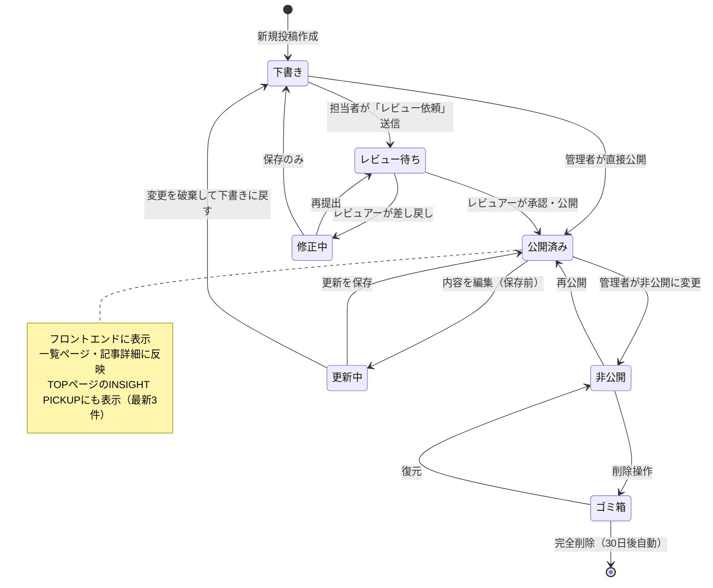
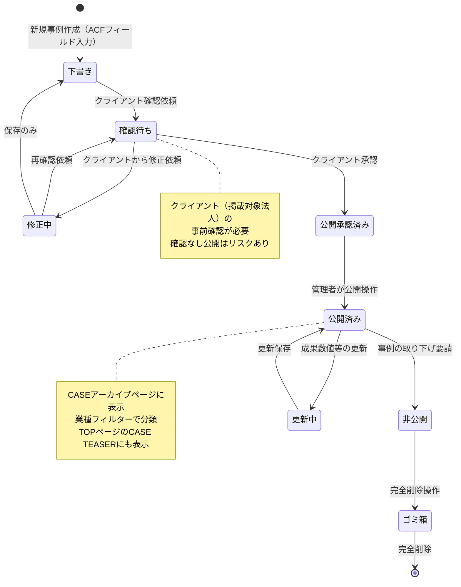

# 状態遷移図 — コンテンツ管理（INSIGHT / CASE）

## INSIGHT 記事の状態遷移

---

## CASE 事例の状態遷移

---

## WordPress コンテンツ状態マッピング

| 上記状態 | WordPress ステータス | 備考 |
|---------|-------------------|------|
| 下書き | `draft` | 管理画面のみ表示 |
| レビュー待ち / 確認待ち | `pending` | Pending Review |
| 公開済み | `publish` | フロントに表示 |
| 非公開 | `private` | 管理者のみ閲覧可 |
| ゴミ箱 | `trash` | 30日後自動削除 |
| 修正中 / 更新中 | `draft`（新リビジョン） | WordPressリビジョン管理 |

---

## CASE カスタムフィールド（ACF）の入力完了状態

CASE は公開前に以下フィールドが全て入力済みであること：

| フィールド | 必須 |
|-----------|------|
| 業種 (`case_industry`) | ✓ |
| 施設規模 (`case_scale`) | — |
| 地域 (`case_region`) | — |
| 課題（支援前） (`case_challenge`) | ✓ |
| 成果（数値） (`case_result_number`) | ✓ |
| 成果（説明） (`case_result_text`) | ✓ |
| クライアントの声 (`case_testimonial`) | — |
| アイキャッチ画像 | ✓ |
